# DishDash 🍽️

A modern food delivery application built with Flutter that offers a seamless ordering experience, real-time chat support, and order tracking. DishDash provides an intuitive interface for users to browse, order, and enjoy their favorite meals.

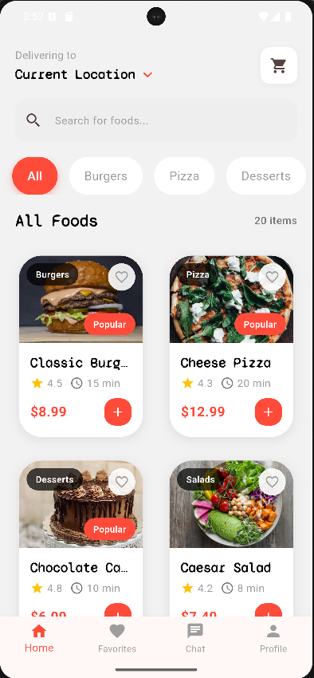

## ✨ Features

### 1. Browse & Order Food

- Browse through various food categories
- View detailed food information
- Add items to cart
- Search functionality

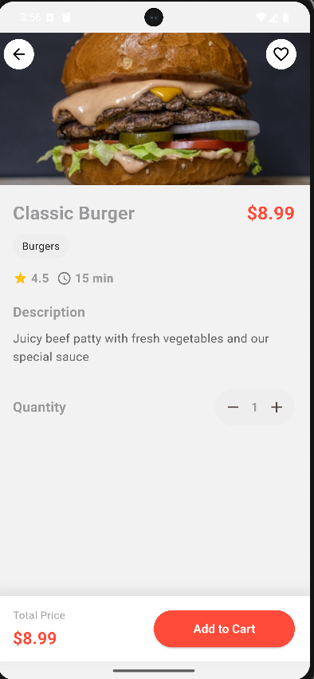

### 2. Shopping Cart Management

- Add/remove items
- Adjust quantities
- View total price
- Quick checkout process

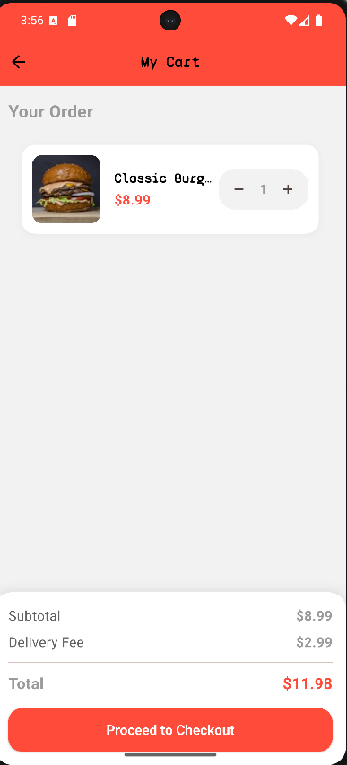

### 3. Checkout Process

- Multiple delivery address support
- Order summary
- Various payment options
- Order confirmation

| Delivery Address                                       | Order Summary                                      | Payment                                      |
| ------------------------------------------------------ | -------------------------------------------------- | -------------------------------------------- |
| 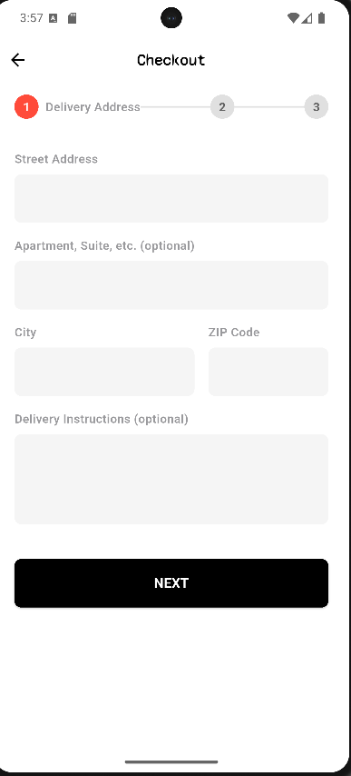 | 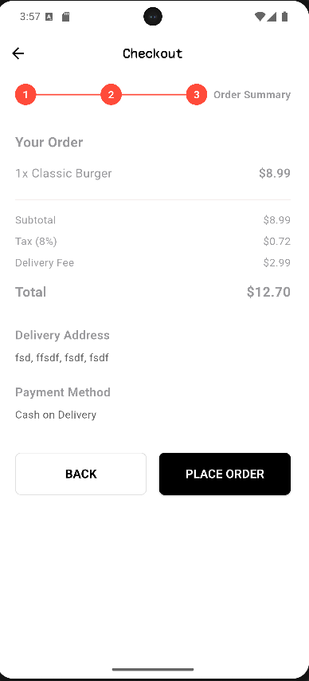 | 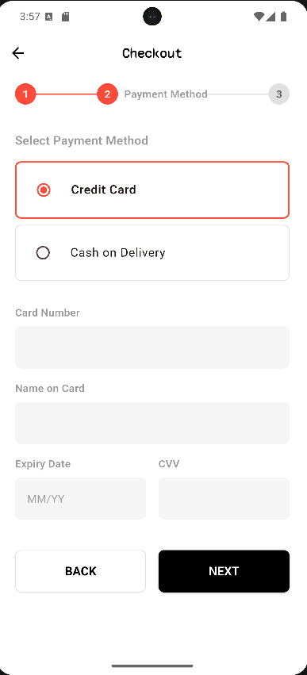 |

### 4. Order Tracking

- View order status
- Order history
- Detailed order information
- Order completion confirmation

| Order History                             | Order Detail                            | Complete Order                              |
| ----------------------------------------- | --------------------------------------- | ------------------------------------------- |
| 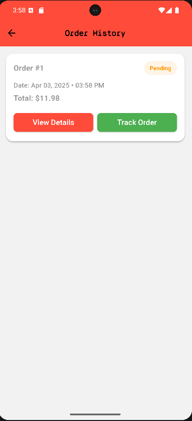 | 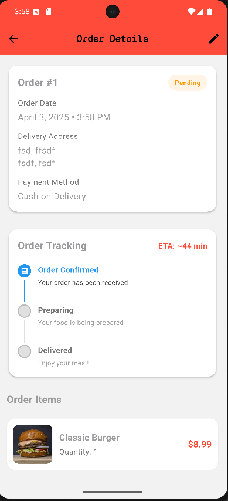 | 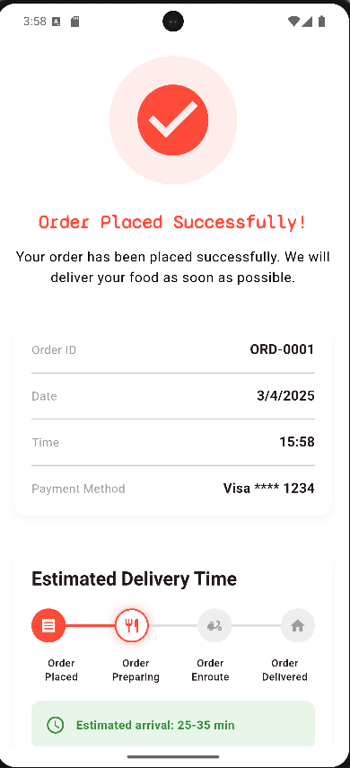 |

### 5. User Profile Management

- User profile customization
- Edit personal information
- View order history
- Manage favorites

| Profile                             | Edit Profile                                  |
| ----------------------------------- | --------------------------------------------- |
| 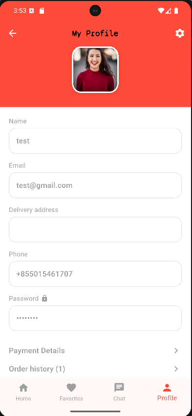 | 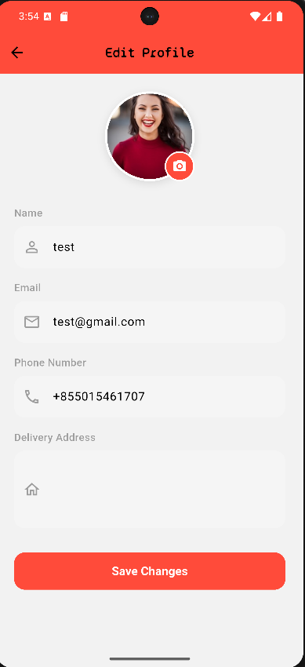 |

### 6. Favorites

Save and manage your favorite dishes for quick reordering

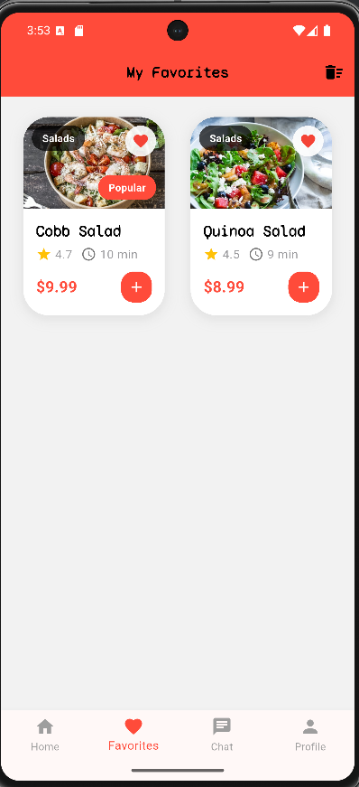

### 7. Customer Support

Real-time chat support for instant assistance

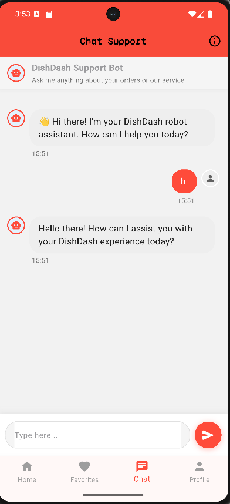

## 🛠️ Technical Stack

- **Framework**: Flutter
- **State Management**: Provider
- **Local Storage**: SQLite
- **Architecture**: Repository Pattern
- **Platform Support**: iOS, Android, Web, Desktop (Windows, macOS, Linux)

## 📱 Supported Platforms

- Android
- iOS
- Web
- Windows
- macOS
- Linux

## 🚀 Getting Started

### Prerequisites

- Flutter SDK (latest version)
- Android Studio / Xcode
- Git

### Installation

1. Clone the repository

```bash
git clone https://github.com/Vannakem2021/DishDash.git
```

2. Navigate to project directory

```bash
cd DishDash
```

3. Install dependencies

```bash
flutter pub get
```

4. Run the app

```bash
flutter run
```

## 📄 Project Structure

```
lib/
├── models/         # Data models
├── providers/      # State management
├── repositories/   # Data layer
├── screens/        # UI screens
├── utils/          # Utilities
└── widgets/        # Reusable widgets
```

## 🤝 Contributing

1. Fork the Project
2. Create your Feature Branch (`git checkout -b feature/AmazingFeature`)
3. Commit your Changes (`git commit -m 'Add some AmazingFeature'`)
4. Push to the Branch (`git push origin feature/AmazingFeature`)
5. Open a Pull Request

## 📝 License

This project is licensed under the MIT License - see the LICENSE file for details.

## ✨ Credits

Developed by [Vannakem2021](https://github.com/Vannakem2021)
